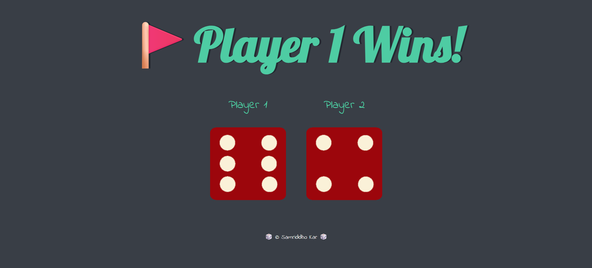
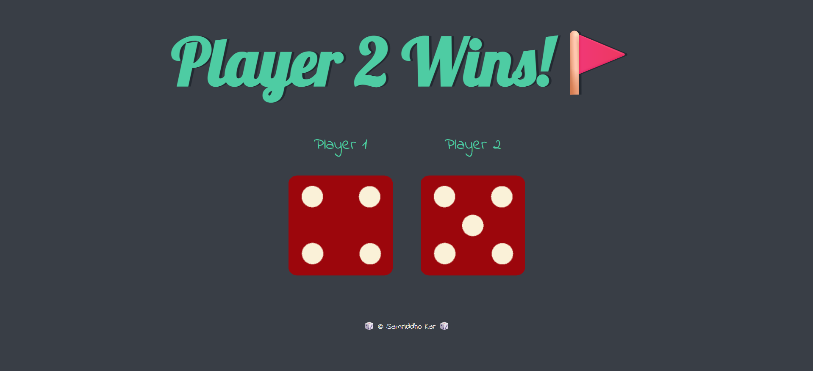
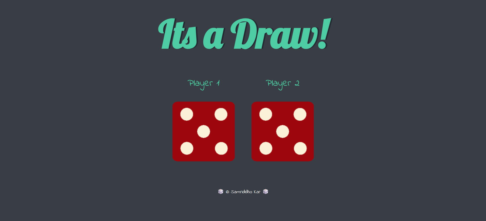

# 🎲 Dice Game

A simple web-based dice game built using HTML, CSS, and JavaScript. The application generates random dice rolls for two players and automatically determines the winner based on the generated values.

---

## 📸 Preview






---

## 🚀 Features

- Random dice generation for both players
- Dynamic dice image rendering
- Automatic winner determination
- Draw detection
- Clean and responsive interface

---

## 🛠️ Technologies Used

- HTML5
- CSS3
- JavaScript

---

## 📂 Project Structure

```text
Dice-Game-js/
├── dice.html
├── styles.css
├── index.js
└── images/
    ├── dice1.png
    ├── dice2.png
    ├── dice3.png
    ├── dice4.png
    ├── dice5.png
    └── dice6.png
```

---

## ⚙️ How to Run

1. Clone the repository

```bash
git clone https://github.com/Samriddho24/Dice-Game-js.git
```

2. Open the project folder

3. Run `dice.html` in your browser

4. Refresh the page to generate new dice rolls

---
